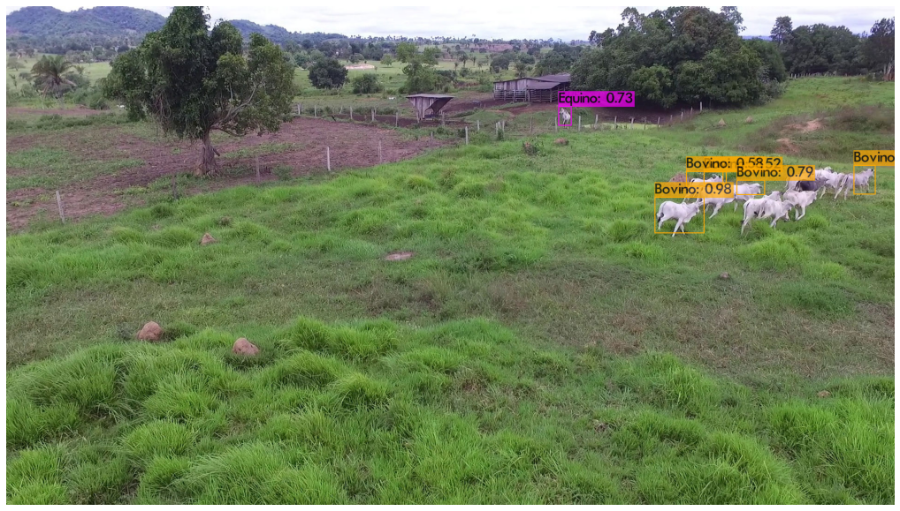
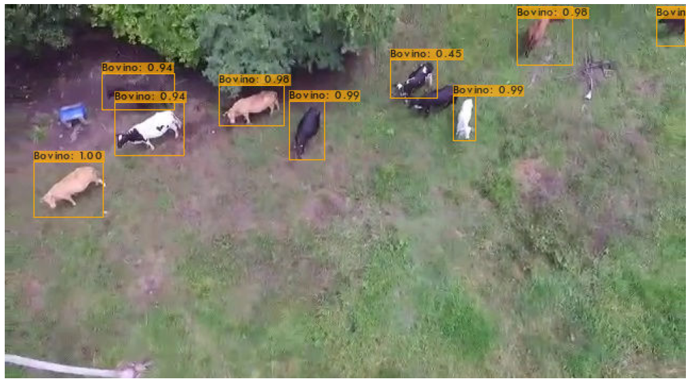

# Yolo v4 e Darknet

## Rede Neural para detecção de animais 

Este repositório representa a pesquisa e implementação da tarefa de detecção de animais em vias públicas desenvolvida pelo grupo de Visão Computacional, ele é um complemento do relatório final do projeto, onde foram explicados os detalhe da implementação. Neste repositório constam os links das lições aprendidas e desenvolvidas para atender a demanda de detecção em imagens aéreas.

   

Foi utilizada a rede neural YOLOv4 e o framework Darknet. Para mais informações consulte o artigo original do modelo <a href="https://arxiv.org/abs/2004.10934">YOLO v4</a> e a descrição completa do framework <a href="http://pjreddie.com/darknet/">Darknet</a>

## Descrição do conjunto de treinamento
As imagens utilizadas para o treinamento e teste do modelo são compostas de duas abordagens: imagens relativamente próximas e imagens aéreas que foram coletadas com drones na região entorno da cidade de Canaã dos Carajas. A intenção é extrair características próximas e distantes das classes: Equino, Bovino, Animais e Suino.
### Resumo do Dataset
Total de imagens 3500 e 4613 anotações

| Classes | Imagens  | Anotações  |
| :-----: | :-: | :-: |
| Equino | 1000 | 1332 |
| Bovino | 700 | 1115 |
| Animais | 1150 | 1435 |
| Suino | 650 | 731 |

## Exemplos de Inferência do Modelo
### Vídeo

   

### Imagens

   

## Notebook

Foi utilizado o ambiente de desenvolvimento do Google Colabory para implementar os testes e treinamento do detector, podendo ser testado no notebook abaixo

- **Detecção de animais**

## Tutoriais

* [Extração de frames](https://github.com/louzeiro/yolov4_carajas/wiki/Extra%C3%A7%C3%A3o-de-frames-em-v%C3%ADdeos)

* [Criação de dataset personalizado](https://github.com/louzeiro/yolov4_carajas/wiki/Dataset-personalizado)&nbsp;
